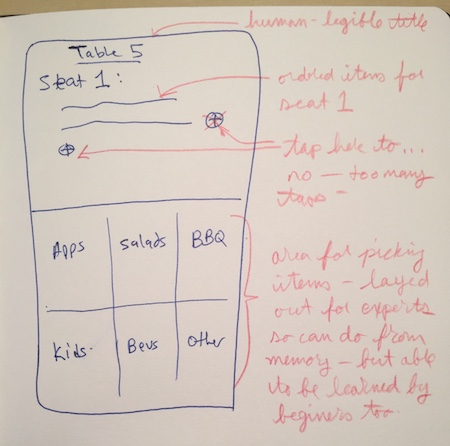
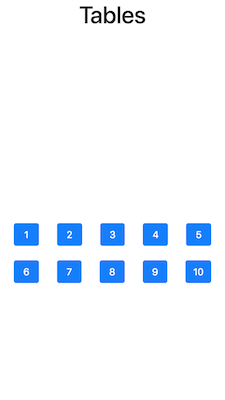
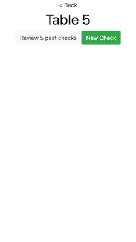
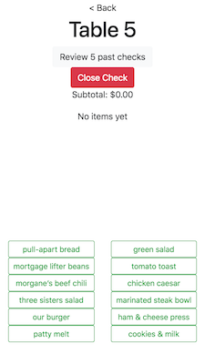
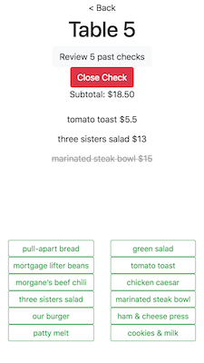
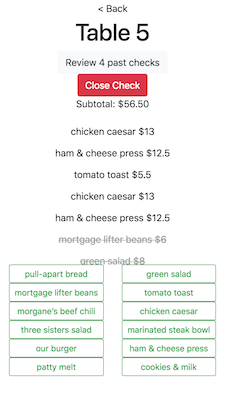
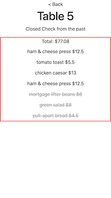

# Avero Check API UI Exercise

### Dev Log

**Monday 7:45pm** Started project. Read through the spec and API. No magic here. Using postman to check all the endpoints. Neat, they all work.

**Monday 8:30pm** Sketching out a UI mockup. The UX obviously will depend on what kind of device (phone-size, tablet-size, or computer-bolted-to-the-table). I'm going to roll with a smartphone that has good network signal.

For the record, I've never waited tables, and if this was a real thing the very first thing I would do would be to go do some ethnography: observe users in the wild, then talk with them about life in the biz. But in a quick little hack like this, I'll just design for a make believe user based on my assumptions.

So, the UX has to be designed for:

- A server (stressed out, slightly drunk)
- One-handed use (stressed-out server is bringing table 7 a beer but gets waylaid by table 2)
- A small menu (no Cheesecake factory Tome Of Infinite Choices... we only have 12 items)

The main UI shows the floor plan. Each table has a number, and tapping a table will take you to a new layer for working with that table's check. The floor plan can also color code tables (e.g. available, what are your tables, who just sat down and needs drinks, where are the checks closed and guests are hanging out, etc.)

The item entry UI should be geared for efficiency. This is where most data entry happens, and it should be crystal clear what the situation is.

Drilling down into an item category gives some specific options, and if there's not room for all of them, there's a 'more' option that can drill down further. There's a fat green `<` button at the top left that can be used to dismiss the page. A swipe left/right would be better, but that's for v2.

**Monday 9:20pm** The business requirements have some points that aren't in the typical rhythm. E.g. the server generally operates with open checks, adding items, and then closing it out. Off-rhythm tasks include opening up a check for table X from earlier in the day (or week?)

In this spec a check is either open or closed, but it seems there is a middle ground where a party has asked for their bill, and they need to add tip. But since I get to fill in missing info, I elect to make the Greasy Spoon one of those no-tip zones where waitstaff do not receive tips at all but instead make a dignified salary with benefits.

**Monday 9:30pm** Going to finish the night by getting a baseline 'hello world' React app working and push it to GitHub.

**Monday 10pm** Done for the night. Read up on `fetch` and how adding headers works there. Proof of concept in the little app.

**Tuesday 7pm** Playing with the hello world app, kicking the react tires. Hey I can load it on my phone by hitting the local IP!

**Tuesday 7:40pm** Got a separate component to work, loading data from network and showing it. Had trouble with unit tests because network data load completed after the component was unmounted, which caused `setState` to error. Use a `this._isMounted` variable to guard. (done for now)

**Tuesday 9:50pm** Breaking out component model: floor plan, checks, items, etc.

**Tuesday 10:50pm** Got App component to use re-useable functions to hit API and get data back using fetch with Authorization. JS module exports is wonky. Done for the night.

**Wednesday 2:30pm** Can sneak half an hour in before office hours. Going to try to render table info in the floorplan component. (oh nice, got that working in like two minutes.)

**Wednesday 8:50pm** Working on a way to conditionally show a single component based on which is on 'top'. Since this is like a single-page phone app, that's important. Initial way to do it is to pass in a `top` value into each component and have them decide if they should show or not by setting their css class to `hidden`. But I don't like that solution because it spreads the responsibility down into places where it doesn't belong. I'm going to conditionally show from the top-level app instead.

**Wednesday 9:50pm** Resisting the temptation to optimize. The API is simple and straightforward, though it lacks some calls that I'd like. For example, "give me only checks for table X from today". Its all good, I'll just abuse the network.

**Wednesday 11:30pm** Can identify the checks for a given table, pull out the current one (if there is one) and send it to a `<Check>` component. Nice.

**Thursday 1pm** Just continuing with building UI elements, having them show when appropriate, getting data from api each time.

**Thursday 2:20pm** Same. Fetching menu in the app and passing it around to components that need it, since (like the table list) this should not change frequently like checks. Can show the added items in the check order list.

**Thursday 3:20pm** Now need to be able to void existing order items.

**Thursday 4:50pm** Voiding works, can pick thing to void in item list, it sends request to the server and client whacks data as appropriate and UI changes smoothly. Absolutely no error checking or any such frippery! Obviously that'd need to change, but as a prototype this is OK.

**Friday 3:40pm** Most of the functionality is there, but still some missing parts. Making a little punchlist of what's left to do for the spec, and then I can style it.

- [x] Be able to close a check
- [x] Get a subtotal price for a check (sum of non-voided ordered items)
- [x] View closed checks for a given table (give list, grouped by date)
- [x] Closed checks have tax and tip as separate line items (server computes,  they are part of the closed check object, `tax` and `tip`)

Starting at the top!

**Friday 4:20pm** Can close a check.

**Friday 4:50pm** Adds non-voided items in a check to show subtotal.

**Friday 9:10pm** Starting to add the check review features. Money values can be wonky, in IEEE754 awfulness like `$12.33824893`. Need to make or get a money laundering function to turn it into `$12.34`, rounded to the nearest penny. Spec doesn't say anything about that so I'll just assert that. Date values have similar unfriendliness.

**Friday 10:20pm** Can now view closed checks per table. There is some flicker when loading different views because data loads asynchronously, so the view temporarily has stand-in or old information as the new stuff loads. One fix for that is to have a sentinel value in the state and only render once everything is loaded. Similar to the `this._isMounted`, could have a `this._isLoadingSomething`.

**Friday 10:45pm** Done with those punchlist items. Going to punt on grouping closed checks by date, though I should probably order them by date. Remaining stuff to do:

- [x] Present closed checks by date
- [x] Show human-readable date and money strings
- [ ] Styling
- [ ] Clean up code & document somewhat.

The styling part could take a while, so I'll probably just time-box it and call it done when the timer goes off.

**Saturday 10am** Use `price.toFixed(2)` to format price, and installed `moment.js` to handle date formatting. Yarn is nice. Now "just" need to do styling, cleanup, document, and then ship it!

**Saturday 2pm** Installed `reactstrap`, got it configured (needed to add references to various files, wasn't obvious what exactly to do from the onset). Now rendering table buttons using bootstrap, and have a bunch of space so the server's thumb can reach the buttons. Moving on to style the other stuff, should be smooth sailing now that I've figured out which way is up.

**Saturday 3:45pm** The order entry area looks decent by now. They're bootstrap buttons, but changed the style so they look like plain text. When tapped the `danger` style kicks in and it glows red, because you just voided that item. Only a little bit more to do for styling. Need to make voided items look good.

**Saturday 3:50pm** OK that was easy. I'm basically done with meeting the spec and having a not-totally-bad UX. Here's some stuff that I could address next, if I kept going:

- If you load a table that doesn't have an open check, the options are 'review N past checks' and 'New Check'. They are too far from the user's thumb.
- Same thing with the `< Back` button at the top.
- The closed check review UI doesn't show the table/date/time, but it should.

**Saturday 8:00pm** Added an autoscroll so when you add items that overloads the list o' ordered items it will scroll to the bottom of that list.

Time so far: 13h:40m

## Some final screenshots

  
     
